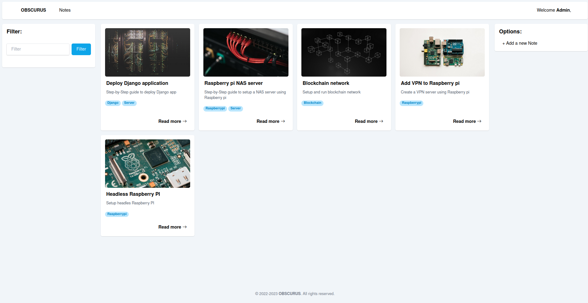

# Obscurus

Obscrurus is a Knowledge Management System **(KMS)**.
The idea originated from the fact that most of the time wasted while working was solving the same problems over and over again, where a proper documentation and knowledge sharing could have saved a lot of time and effort, hence, saving money.

## Tech stack

- Django
- PostgreSQL
- Docker
- TailwindCSS

## Key features

- Authentication system
- Tagging system
- Search system
- Markdown as a main markup language for notes
- Export notes
- Table of contents for each note
- Code highlighting
- Pagination
- Unsplash integration

## Demo

**Obscurus** is deployed on Strato.de servers, check from [here](h2987968.stratoserver.net/).
To login, use the following credentials:

- Username: `guest`
- Password: `guestuser1234`

